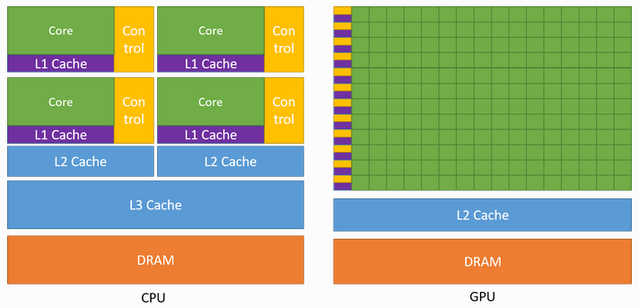

## GPU Architecture

https://docs.nvidia.com/deeplearning/performance/dl-performance-gpu-background/index.html
https://enccs.github.io/openmp-gpu/gpu-architecture/
https://fabiensanglard.net/cuda/
https://www.megware.com/fileadmin/user_upload/LandingPage%20NVIDIA/nvidia-ampere-architecture-whitepaper.pdf

## How does processes communicate?
- Relies on IPC to achieve inter process communication.

### Shared memory
- Explicitly create a common shared memory region between processes.
- Operations:
    1. `shmget`: Create a new shared memory region.
    2. `shmat`: Attach the shared memory region to own address space.
    3. `shmdt`: Detach the shared memory region from own address space.
    4. `shmctl`: Manage the shared memory region, e.g. deletion. 
- Need synchronization to prevent data races.

### Message Passing
- Explicitly send/receive messages through message queues managed by kernel.
- Operations:
    1. `mq_open`: Create/open message queue, identified by a name.
    2. `mq_send`: Sends a message to the queue.
    3. `mq_receive`: Receives a message from the queue.
    4. `mq_close`: Close the connection to the message queue.
    5. `mq_unlink`: Delete the message queue once it's no longer needed.

### Pipe (Unix)
- Connect 2 processes: 1 producer + 1 consumer.
- `pipe(int fd[2])` creates a pair of file descriptors.
    - `fd[0]` is the read end while `fd[1]` is the write end.

### Signal (Unix)
- `kill(pid_t pid, int sig)` is the syscall used to send signals between processes.
- Process can define custom behaviour on handling different signals.

### Unix Domain Sockets (Unix)
- Same API as network sockets but bypass network stack. Hence, only use for processes on the same machine.

## Process v.s. Thread
- Threads in the same process 
    - Shared:
        - Code, Data, Heap.
        - Process id, file descriptors.
    - Not shared:
        - Program counter.
        - Registers.
        - Stack region and stack pointers.
- Thread is lightweight and hence faster to create.
- Context switching is faster for threads, less things to be swapped.
