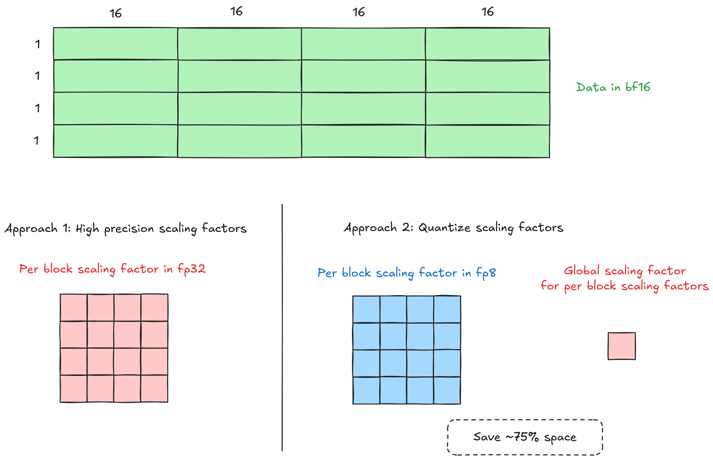

# [NVFP4 Quantization](https://www.arxiv.org/abs/2509.25149)

- NVFP4 groups 16 elements into a block and uses a shared scaling factor for the entire block.
- Scaling factor is computed as:

$$s_{enc,b} = \frac{6}{amax_b}$$

$$s_{dec,b} = \frac{1}{s_{enc,b}} = \frac{amax_b}{6}$$

> 6 is the maximum representable value in E2M1 format.

- The goal is to do matrix multiplications in FP4 format for higher throughput and lower memory bandwidth.

## Approach 1:

- Quantization is simply, $qx = round(x \cdot s_{enc,b})$
- Store each block's $s_{dec,b}$ as FP32.
- During matmul for a block, compute 

$$s^x_{dec,b} \cdot s^{y}_{dec,b} \cdot \sum_{k=1}^b (x_k \cdot y_k)$$

### Downside:
- Scaling factors take up a significant amount of memory. Requires higher memory bandwidth during matmul.

## Approach 2:
- Quantize the entire scaling factor tensor to FP8 (E4M3) format.

### Scaling factor quantization:
- The maximum scaling factor is when $amax_b = amax_{tensor}$, i.e. $max(s_{dec,b}) = amax_{tensor}/6$.
- Hence, $$s_{enc,sf} = \frac{448}{amax_{tensor}/6} = \frac{448 \cdot 6}{amax_{tensor}}$$

> 448 is the max representable value in E4M3 format

- Scaling factor is now $s_{dec,b,e4m3} = round(s_{dec,b} \cdot s_{enc,sf})$

### Data quantization:
- Because of rounding errors, $s_{dec,b} \neq s_{dec,b,e4m3} \cdot s_{dec,sf}$. Since what we get is the latter, we would want the encoding factor to be taking this into account.
- Originally, we have $s_{enc,b} \cdot s_{dec,b} = 1$. So, 

$$s_{enc,b} = \frac{1}{s_{dec,b}}$$

- Now, due to the quantization error, we want $s_{enc,b} \cdot s_{dec,b,e4m3} \cdot s_{dec,sf} = 1$. So,

$$s_{enc,b} = \frac{1}{s_{dec,b,e4m3} \cdot s_{dec,sf}}$$

